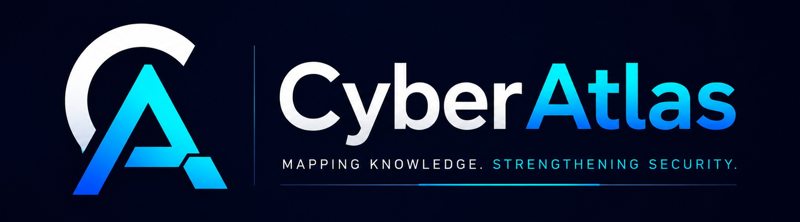

<div align="center">



# CyberAtlas

**Mapping the World of Cybersecurity**

[](.)
[](LICENSE)
[](.)
[](CONTRIBUTING.md)

</div>

---

## About This Repository

Cybersecurity is not only about hacking.

It is about understanding how attacks happen, why they succeed, who is affected, how organizations respond, how regulations evolve, and how security intersects with daily life — from personal privacy to national infrastructure.

CyberAtlas is a long-term public knowledge base. It is designed to grow continuously: covering technical topics, security awareness, real-world incidents, laws, education, and personal learning documentation.

It is not a course. It is not a cheat sheet collection. It is a structured knowledge platform built for depth, clarity, and long-term use.

---

## Knowledge Map

| Section | What It Covers |
|---|---|
| [Technical](technical/) | Core cybersecurity skills — networking, operating systems, web security, cloud, cryptography, malware analysis, incident response |
| [Explore](explore/) | The broader landscape — privacy, AI security, social engineering, ransomware as an industry, deepfakes, digital footprints |
| [Case Studies](case-studies/) | Real incidents, analyzed — data breaches, ransomware attacks, nation-state operations, security failures |
| [Laws & Privacy](laws-and-privacy/) | Legal frameworks, data protection rights, compliance, and digital ethics |
| [School Cybersecurity](school-cybersecurity/) | Security awareness in education — students, teachers, institutions |
| [Resources](resources/) | Curated external references — books, courses, tools, cheatsheets |

---

## Repository Philosophy

> Understanding cybersecurity deeply — not just technically — builds better defenders, clearer communicators, and more security-aware citizens.

Three principles guide every piece of content in this repository:

**Depth over breadth.** A well-explained concept is more valuable than ten shallow summaries.

**Context over commands.** Understanding *why* a technique works matters more than memorizing syntax.

**Relevance over completeness.** Not everything needs to be covered. What is here should be worth reading.

---

## Sections

### 📚 Technical

Core knowledge areas for anyone building a cybersecurity skill set. Topics are organized by domain, not by difficulty. Covers networking fundamentals, Linux and Windows internals, web application security, Active Directory architecture, cloud infrastructure security, cryptography, malware analysis, incident response, and threat hunting.

→ [Browse Technical](technical/)

---

### 🔭 Explore

Cybersecurity does not exist in isolation. This section covers the broader landscape: how privacy erodes incrementally, how AI reshapes the threat model, how social engineering exploits cognitive patterns, how ransomware operates as a criminal enterprise, and how digital footprints expose individuals beyond their awareness.

→ [Browse Explore](explore/)

---

### 🔍 Case Studies

Real incidents examined with structured analysis. Every case study follows a consistent format: what happened, how it unfolded, what the impact was, and what can be learned. Cases span data breaches, ransomware attacks, nation-state intrusions, and security failures at scale. No speculation — only documented facts with cited sources.

→ [Browse Case Studies](case-studies/)

---

### ⚖️ Laws & Privacy

Security and law are inseparable. This section covers data protection legislation, privacy rights, compliance frameworks, and digital ethics — explained for a technical audience without unnecessary legal jargon. Covers GDPR, PDPA, and regional equivalents, along with emerging digital ethics questions.

→ [Browse Laws & Privacy](laws-and-privacy/)

---

### 🏫 School Cybersecurity

Educational institutions are high-value, systematically under-secured targets. This section addresses security awareness for students, resources for teachers, institutional security practices, and digital literacy frameworks applicable to academic environments.

→ [Browse School Cybersecurity](school-cybersecurity/)

---

### 📖 Resources

A curated list of books, courses, tools, and references. Organized by category, with brief annotations explaining why each resource is worth your time. Not a link dump — every entry is here for a specific reason.

→ [Browse Resources](resources/)

---

## Repository Structure

```
cyber-notes/
│
├── README.md                     ← This file
├── CONTRIBUTING.md               ← Contribution guidelines
├── CHANGELOG.md                  ← Update history
│
├── docs/                         ← Repository meta-documentation
│   ├── roadmap.md                ← Planned topics and future sections
│   ├── style-guide.md            ← Writing and formatting conventions
│   └── glossary.md               ← Key term definitions
│
├── technical/                    ← Core cybersecurity knowledge
│   ├── networking/
│   ├── linux/
│   ├── windows/
│   ├── web-security/
│   ├── active-directory/
│   ├── cloud-security/
│   ├── cryptography/
│   ├── malware-analysis/
│   ├── incident-response/
│   └── threat-hunting/
│
├── explore/                      ← Broader security topics
│   ├── data-breaches/
│   ├── digital-privacy/
│   ├── ai-security/
│   ├── social-engineering/
│   ├── ransomware/
│   ├── deepfakes/
│   └── digital-footprint/
│
├── case-studies/                 ← Real-world incident analysis
│   ├── breaches/
│   ├── ransomware-attacks/
│   ├── nation-state/
│   └── lessons-learned/
│
├── laws-and-privacy/             ← Legal frameworks and compliance
│   ├── data-protection/
│   ├── compliance/
│   └── digital-ethics/
│
├── school-cybersecurity/         ← Education-focused security content
│   ├── student-security/
│   ├── teacher-resources/
│   └── awareness-programs/
│
├── resources/                    ← Curated external references
│   ├── books.md
│   ├── courses.md
│   ├── tools.md
│   └── cheatsheets/
│
└── _templates/                   ← Templates for all content types
    ├── topic.md
    ├── case-study.md
    ├── awareness-article.md
    └── law-regulation.md
```

---

## Roadmap

The roadmap tracks planned topics, in-progress content, and future directions for this repository.

→ [View Roadmap](docs/roadmap.md)

---

## Contributing

Contributions are welcome. New topics, corrections, and case studies can all be submitted.

Before contributing, read the [Contributing Guide](CONTRIBUTING.md) and the [Style Guide](docs/style-guide.md). Use the appropriate [template](_templates/) for new content.

---

## Latest Additions

> This section is updated manually as new content is added.

| Date | Section | Topic |
|------|---------|-------|
| 2026-06-02 | Explore / AI Security | [AI dalam Cybersecurity: Senjata Baru di Kedua Sisi](explore/ai-security/ai-dalam-cybersecurity.md) |
| 2026-06-02 | Explore / AI Security | [AI dalam Kehidupan dan Pekerjaan Sehari-Hari](explore/ai-security/ai-dalam-kehidupan-sehari-hari.md) |
| 2026-06-02 | Explore / AI Security | [AI Menggantikan Manusia: Ancaman Nyata atau Alarm Palsu?](explore/ai-security/ai-menggantikan-manusia.md) |
| 2026-06-01 | Laws & Privacy | [UU PDP — Undang-Undang Perlindungan Data Pribadi Indonesia](laws-and-privacy/data-protection/uu-pdp-indonesia.md) |

---

## License

Content in this repository is licensed under [MIT](LICENSE) unless otherwise specified. Attribution is appreciated.

---

<div align="center">
<sub>CyberAtlas · Mapping the World of Cybersecurity</sub>
</div>
