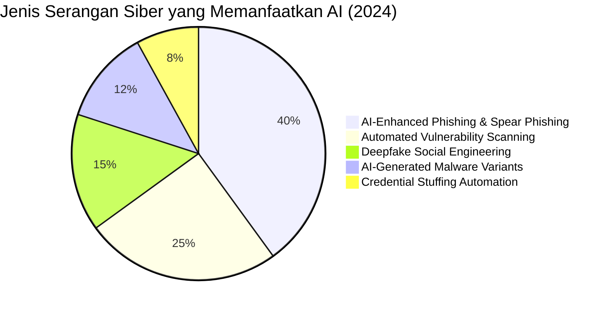
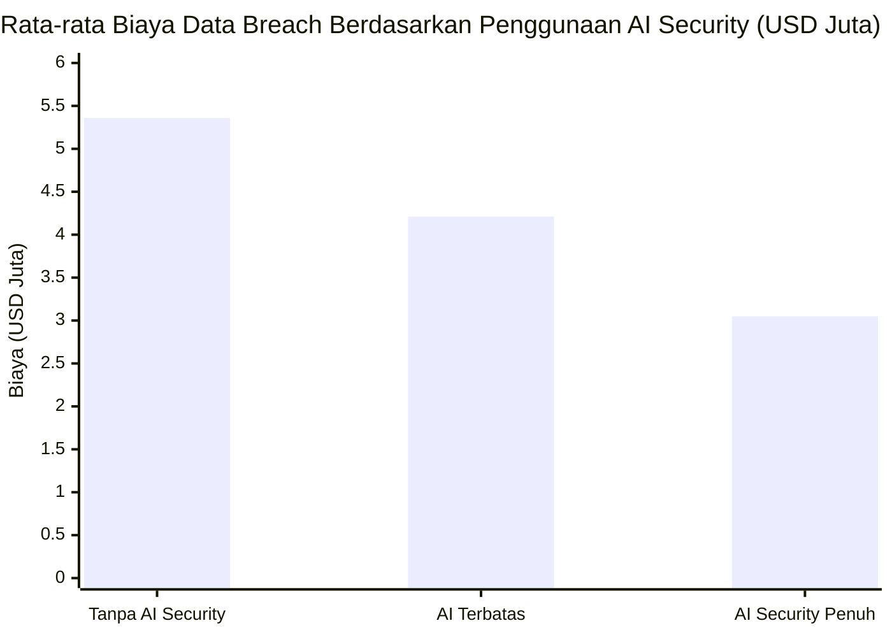

---
title: "AI dalam Cybersecurity: Senjata Baru di Kedua Sisi"
section: explore
topic: ai-security
date_created: 2026-06-02
last_updated: 2026-06-02
status: published
language: id-en (bilingual mixed)
tags: [AI, cybersecurity, threat-detection, AI-attacks, SOC, blue-team, red-team, security-profession]
---

# AI dalam Cybersecurity: Senjata Baru di Kedua Sisi

Di satu sisi, AI sedang digunakan untuk bikin email phishing yang lebih meyakinkan dari sebelumnya, dipersonalisasi per target, bebas typo, dan dikirim dalam jumlah besar yang tidak mungkin dilakukan manusia secara manual. Di sisi lain, AI yang sama digunakan untuk mendeteksi serangan-serangan itu dalam hitungan detik, jauh lebih cepat dari analyst manusia mana pun.

Inilah yang terjadi di cybersecurity sekarang: AI arms race. Teknologi yang sama bisa jadi senjata serang sekaligus perisai pertahanan, tergantung siapa yang memegangnya dan untuk tujuan apa.

---

## Table of Contents

- [AI sebagai Alat Serangan](#ai-sebagai-alat-serangan)
- [AI sebagai Alat Pertahanan](#ai-sebagai-alat-pertahanan)
- [AI dan Profesi di Bidang Cybersecurity](#ai-dan-profesi-di-bidang-cybersecurity)
- [Profesi Baru yang Muncul](#profesi-baru-yang-muncul)
- [Tantangan dan Keterbatasan](#tantangan-dan-keterbatasan)
- [Implikasi untuk Kita Semua](#implikasi-untuk-kita-semua)
- [Key Takeaways](#key-takeaways)
- [Sources](#sources)

---

## AI sebagai Alat Serangan

Memahami bagaimana attacker menggunakan AI itu penting untuk bisa bertahan. Bukan untuk meniru tekniknya, tapi untuk tahu apa yang sedang kita hadapi.

### Phishing yang Jauh Lebih Meyakinkan

Phishing email lama punya ciri-ciri yang sudah banyak orang kenali: bahasa yang aneh, subject line yang terlalu umum, lampiran yang mencurigakan. AI mengubah semua itu.

Menurut SlashNext State of Phishing Report 2022, volume phishing attack meningkat **61% dalam satu tahun**. Yang lebih mengkhawatirkan: penelitian dari Hoxhunt (2023) menunjukkan phishing email yang dibuat AI **3x lebih efektif** dalam menipu target dibanding yang dibuat manual karena lebih personal dan bebas error.

Dengan AI, penyerang sekarang bisa bikin phishing email yang ditulis dengan bahasa yang natural, dipersonalisasi berdasarkan informasi publik si target (LinkedIn, media sosial, berita perusahaan), menyesuaikan gaya bahasa dengan komunikasi internal organisasi yang ditarget, dan dibuat dalam jumlah sangat banyak tanpa perlu usaha manual yang besar.

### Mencari Celah Keamanan Lebih Cepat

AI bisa digunakan untuk menemukan input yang tidak terduga yang bisa memicu perilaku aneh dalam sebuah aplikasi, menganalisis kode untuk menemukan celah keamanan dalam jumlah kode yang sangat besar, dan mempercepat riset tentang kelemahan sistem yang sebelumnya butuh usaha manual yang besar.

Perlu dicatat: ini juga bisa dipakai oleh tim keamanan dan peneliti security. Tapi hambatan bagi penyerang untuk melakukan ini juga jadi lebih rendah.

### Malware yang Lebih Sulit Dideteksi

AI bisa membantu penyerang untuk membuat variasi malware yang menghindari deteksi berbasis signature lama, mempelajari pola dari tools keamanan supaya bisa menyesuaikan diri agar tidak ketahuan, dan mengotomasi proses pengintaian dan aksi setelah berhasil masuk ke sistem.

### Deepfake untuk Social Engineering

Voice cloning AI sudah cukup maju untuk meniru suara seseorang dari sample audio yang tidak terlalu panjang. Video deepfake juga semakin mudah dibuat. Ini membuka jenis serangan baru: CEO fraud yang bukan hanya email tapi video call, atau voice message dari "atasan" yang minta transfer uang segera.

Ini bukan khayalan. Sudah ada kasus nyata dimana perusahaan kehilangan miliaran rupiah karena video call deepfake yang meniru eksekutif.

---

## AI sebagai Alat Pertahanan

Sekarang sisi yang sama pentingnya: bagaimana AI digunakan oleh tim keamanan. Data dari IBM Cost of Data Breach Report 2024 memberikan gambaran yang cukup jelas tentang seberapa besar perbedaannya.

Organisasi yang menggunakan AI security secara penuh rata-rata mengeluarkan **$3.05 juta** per insiden breach, dibanding **$5.36 juta** untuk yang tidak menggunakan AI sama sekali: penghematan rata-rata **$2.22 juta per insiden**.

### Deteksi Ancaman yang Lebih Cepat dan Lebih Akurat

Sistem keamanan lama bekerja dengan aturan: "kalau ada traffic ke port ini, kirim alert." Cara ini punya batasan yang cukup besar karena tidak bisa menangkap hal-hal baru yang belum pernah dilihat sebelumnya.

AI-based threat detection bekerja secara berbeda. Dengan mempelajari pola normal dari sebuah lingkungan, AI bisa mendeteksi hal-hal yang tidak biasa, bahkan untuk jenis serangan yang belum pernah ada sebelumnya. Menurut IBM 2024, tim security yang pakai AI berhasil mendeteksi dan contain breach **74 hari lebih cepat** dibanding yang tidak.

SIEM modern seperti Splunk, Microsoft Sentinel, dan Wazuh sudah mulai memasukkan machine learning untuk ini.

### Kurangi Alert yang Berlebihan

Salah satu masalah terbesar di Security Operations Center (SOC) adalah kebanjiran alert. Sistem lama bisa generate begitu banyak notifikasi sehingga analyst kewalahan dan mulai melewatkan ancaman nyata di antara banyaknya alert palsu.

Berdasarkan laporan Darktrace, penggunaan AI dalam security operations bisa mengurangi false positive alerts hingga **70%**: yang artinya analyst bisa fokus ke ancaman yang benar-benar nyata.

AI bisa membantu dengan menentukan alert mana yang paling penting untuk ditangani duluan, menghubungkan kejadian-kejadian dari berbagai sumber untuk menemukan pola serangan yang tidak terlihat kalau dilihat satu per satu, dan mengurangi alert palsu yang menghabiskan waktu analyst.

### Respon Otomatis

Untuk jenis insiden yang sudah dipahami dengan baik, AI bisa langsung mengambil tindakan tanpa harus nunggu keputusan manusia: langsung isolasi perangkat yang terinfeksi dari jaringan, blokir alamat IP yang berbahaya, cabut akses akun yang mencurigakan, dan simpan bukti forensik sebelum sempat diubah.

Kecepatan respon seperti ini tidak mungkin dicapai secara manual, terutama kalau serangan terjadi di luar jam kerja. Menurut ESG Research 2024, **69% SOC** sudah mengintegrasikan AI tools dalam workflow mereka.

---

## AI dan Profesi di Bidang Cybersecurity

Pertanyaan yang paling sering muncul: apakah AI akan menggantikan security analyst, penetration tester, atau incident responder?

Jawaban singkatnya: tidak, tapi cara mereka bekerja akan berubah secara signifikan.

### SOC Analyst

Tugas yang paling berulang dan mekanis dari seorang SOC analyst, yaitu review setiap alert satu per satu secara manual, adalah yang paling berpotensi digantikan AI. AI sudah melakukan triage awal, menghubungkan kejadian, dan bahkan merespons otomatis untuk jenis ancaman yang sudah dikenal.

Yang tetap butuh manusia: menyelidiki alert yang tidak jelas, memahami konteks bisnis dari sebuah insiden, komunikasi dengan stakeholder saat krisis, dan membuat keputusan dalam situasi yang tidak ada playbook-nya.

SOC analyst yang akan berkembang adalah yang menggunakan AI sebagai alat untuk bekerja lebih efektif, bukan yang coba bersaing dengan AI di hal-hal yang AI memang lebih cepat.

### Penetration Tester

AI tools sudah mulai masuk ke toolkit offensive security. Scanner celah keamanan yang lebih cerdas, saran eksploitasi otomatis, dan AI-assisted code review untuk menemukan masalah keamanan.

Tapi penetration testing yang benar-benar bernilai bukan tentang menemukan kelemahan yang jelas. Ini tentang menemukan logika bisnis yang bisa dieksploitasi, kombinasi celah yang baru terlihat kalau digabungkan, dan memahami organisasi cukup dalam untuk tahu jalur serangan mana yang paling berbahaya. Itu masih sangat butuh otak manusia.

### Malware Analyst

AI bisa mempercepat tahap awal analisis malware, mengidentifikasi pola yang mirip dengan malware yang sudah dikenal, dan mengotomasi beberapa bagian dari analisis awal. Tapi memahami malware yang benar-benar baru, membongkar kode yang sengaja disamarkan, dan membuat cara deteksinya: ini masih sangat butuh keahlian manusia yang dalam.

### Threat Intelligence Analyst

Volume data yang perlu diproses dalam threat intelligence, dari pemantauan dark web sampai analisis teknis dan konteks geopolitik, sudah melampaui kemampuan manusia untuk tangani secara manual. AI adalah kebutuhan, bukan pilihan, untuk bisa memahami semua data ini.

Tapi mengubah intelligence jadi rekomendasi yang bisa dipahami oleh pemimpin bisnis, memahami nuansa geopolitik, dan membuat keputusan strategis tentang lanskap ancaman: ini masih sangat butuh manusia.

---

## Profesi Baru yang Muncul

AI tidak hanya mengubah pekerjaan yang sudah ada, tapi juga menciptakan jenis pekerjaan baru di bidang cybersecurity yang sebelumnya tidak ada.

**AI Security Specialist**
Orang yang fokus mengamankan sistem AI itu sendiri: serangan terhadap model AI, keracunan data training, pencurian model, dan prompt injection. Ini bukan subdomain kecil karena sistem AI semakin banyak dipakai di tempat-tempat yang kritis.

**AI Red Teamer**
Red teamer yang spesialisasi dalam menguji sistem AI: mencoba bypass pertahanan berbasis AI, menguji LLM untuk output yang berbahaya, dan mencari cara AI bisa dimanipulasi. Beberapa perusahaan AI besar sudah punya tim khusus untuk ini.

**ML Security Engineer**
Engineer yang membangun kontrol keamanan khusus untuk pipeline AI dan machine learning: mengamankan data training, memastikan integritas model, dan keamanan proses inference sampai deployment.

---

## Tantangan dan Keterbatasan

Adopsi AI dalam cybersecurity bukan tanpa masalah nyata.

**AI jadi target serangan baru.** Kalau organisasi lo sangat bergantung pada tools keamanan berbasis AI, sistem AI itu sendiri bisa jadi target. Serangan yang mengelabui AI, keracunan data training, dan manipulasi AI bisa melemahkan tools keamanan lo kalau tidak dijaga dengan benar.

**Susah dijelaskan kenapa AI curiga.** Ketika AI model flag sesuatu sebagai ancaman, analyst butuh tahu kenapa supaya bisa bertindak dengan tepat. Banyak model AI, terutama yang berbasis deep learning, sulit untuk dijelaskan cara kerjanya. Ini jadi masalah di konteks keamanan di mana keputusan perlu bisa dipertanggungjawabkan.

**AI bisa punya bias.** Model AI yang dilatih dari data masa lalu bisa mewarisi bias dari data itu. Kalau data training kebanyakan berisi ancaman dari satu wilayah atau industri tertentu, model mungkin kurang efektif untuk ancaman yang datang dari konteks yang berbeda.

**Butuh pemahaman lebih dari sekadar klik-klik.** Menggunakan AI security tools secara efektif butuh pemahaman tentang bagaimana machine learning bekerja, bukan hanya cara pakai antarmukanya.

---

## Implikasi untuk Kita Semua

Untuk orang yang tidak bekerja di bidang keamanan sekalipun, perkembangan AI dalam cybersecurity punya implikasi praktis yang worth diketahui.

Phishing yang lebih meyakinkan berarti lo tidak bisa lagi mengandalkan "kalau ada typo pasti palsu" sebagai filter utama. Dengan AI menghasilkan phishing 3x lebih efektif dari sebelumnya, skeptisisme terhadap permintaan yang tidak terduga dan verifikasi lewat jalur yang terpisah jadi lebih penting dari sebelumnya.

Deepfake audio dan video berarti "aku dengar suaranya sendiri" bukan lagi verifikasi yang cukup untuk permintaan yang berisiko tinggi. Organisasi perlu punya cara verifikasi yang tidak bisa dipalsukan hanya dengan AI.

Ada pembahasan lebih dalam tentang phishing dan social engineering di [Social Engineering](../social-engineering/), dan tentang mengelola jejak digital di [Digital Footprint](../digital-footprint/).

---

## Key Takeaways

- AI digunakan oleh kedua sisi: penyerang pakai untuk scale phishing (+61% dalam setahun), otomasi pencarian celah, dan buat deepfake. Defender pakai untuk deteksi lebih cepat (74 hari lebih cepat) dan kurangi biaya breach ($2.22 juta per insiden).
- Profesi security tidak digantikan, tapi cara kerjanya berubah signifikan. Tugas berulang dan mekanis di-assist AI, sementara judgment dan investigasi kompleks tetap butuh manusia.
- 69% SOC sudah mengintegrasikan AI tools, dan AI bisa mengurangi false positive hingga 70%.
- Profesi baru muncul: AI security specialist, AI red teamer, dan ML security engineer adalah peran yang sebelumnya tidak ada.
- Untuk semua orang, implikasi terbesar adalah phishing dan social engineering yang 3x lebih efektif dan tidak bisa dideteksi dengan cara lama.

---

## Sources

- [IBM Cost of Data Breach Report 2024](https://www.ibm.com/reports/data-breach)
- [SlashNext State of Phishing Report 2022](https://slashnext.com)
- Hoxhunt, *AI vs Human Phishing Research*, 2023
- [Darktrace Annual Threat Report](https://darktrace.com)
- ESG Research, *SOC Modernization and the Role of AI*, 2024
- [NIST AI Risk Management Framework](https://www.nist.gov/system/files/documents/2023/01/26/AI%20RMF%201.0.pdf)

---

*explore / ai-security · Dibuat: 2026-06-02*
