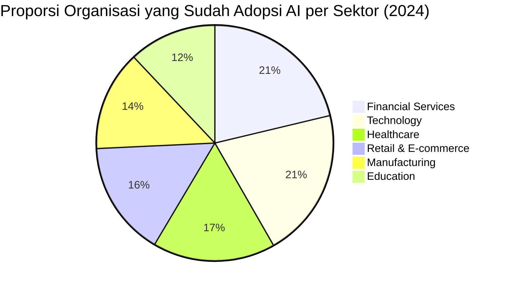

---
title: "AI dalam Kehidupan dan Pekerjaan Sehari-Hari"
section: explore
topic: ai-security
date_created: 2026-06-02
last_updated: 2026-06-02
status: published
language: id-en (bilingual mixed)
tags: [AI, daily-life, productivity, automation, everyday-AI, future-of-work]
---

# AI dalam Kehidupan dan Pekerjaan Sehari-Hari

Lo sudah pakai AI hari ini. Mungkin bahkan sebelum lo benar-benar sadar.

Alarm yang belajar kapan lo biasanya bangun. Rekomendasi lagu di Spotify. Email yang auto-suggest balasan. Filter spam yang nangkap phishing sebelum sampai ke inbox lo. Google Maps yang kasih rute baru karena macet. Semua itu jalan di background, dijalankan oleh AI, dan lo tidak perlu tahu cara kerjanya untuk langsung merasakan manfaatnya.

Menurut McKinsey Global Survey 2024, **72% organisasi di seluruh dunia** sudah mengadopsi AI dalam setidaknya satu fungsi bisnis mereka. Dan itu baru di level organisasi: di level individu, interaksi dengan AI terjadi miliaran kali setiap hari tanpa sebagian besar orang menyadarinya.

Tapi sekarang AI sudah bergerak dari background ke foreground. Dari sesuatu yang invisible jadi sesuatu yang lo aktif gunakan untuk berpikir, nulis, dan kerja. Dan pergeseran ini punya dampak yang lebih besar dari sekadar "teknologinya canggih."

---

## Table of Contents

- [AI yang Sudah Ada Sebelum Lo Sadari](#ai-yang-sudah-ada-sebelum-lo-sadari)
- [AI yang Sekarang Lo Gunakan Secara Aktif](#ai-yang-sekarang-lo-gunakan-secara-aktif)
- [AI di Tempat Kerja: Sektor per Sektor](#ai-di-tempat-kerja-sektor-per-sektor)
- [Bagaimana AI Mengubah Cara Kita Berpikir dan Bekerja](#bagaimana-ai-mengubah-cara-kita-berpikir-dan-bekerja)
- [Yang Perlu Diwaspadai](#yang-perlu-diwaspadai)
- [Cara Pakai AI dengan Bijak](#cara-pakai-ai-dengan-bijak)
- [Key Takeaways](#key-takeaways)
- [Sources](#sources)

---

## AI yang Sudah Ada Sebelum Lo Sadari

Sebelum ChatGPT jadi mainstream di akhir 2022, AI sudah sangat dalam tertanam di kehidupan digital kita. Hanya saja ia tidak menyebut dirinya "AI" secara terang-terangan.

**Rekomendasi konten.** Setiap kali YouTube autoplay ke video berikutnya, Netflix suggest tontonan, atau TikTok tahu persis konten apa yang bikin lo scroll terus: itu semua AI yang belajar dari kebiasaan lo dan terus menyesuaikan apa yang ditampilkan.

**Deteksi penipuan.** Bank lo mungkin sudah beberapa kali secara diam-diam memblokir transaksi yang mencurigakan sebelum lo sempat tahu. Menurut Juniper Research 2023, AI berhasil mendeteksi dan mencegah penipuan senilai **$27 miliar** di sektor perbankan global: angka yang tidak mungkin dicapai dengan tim manusia saja.

**Mesin pencari.** Google tidak sekadar mencari kata yang lo ketik. Sudah bertahun-tahun Google pakai AI untuk memahami maksud di balik pencarian lo. "Tempat makan enak dekat sini" bisa kasih hasil yang relevan meski tidak ada halaman yang berisi kalimat persis itu.

**Filter spam.** Google memproses lebih dari **15 miliar email per hari**, dan AI-nya memblokir **99.9%** di antaranya sebelum sampai ke inbox. Tanpa AI, inbox lo akan penuh spam dalam hitungan jam.

**Pengenalan suara.** Siri, Google Assistant, transcription otomatis di Zoom atau Google Meet: semua ini dijalankan oleh AI yang belajar memahami bahasa manusia, dan akurasinya sudah jauh lebih baik dari beberapa tahun lalu.

Intinya: kalau lo sudah online, lo sudah berinteraksi dengan AI setiap hari jauh sebelum era AI yang sekarang ramai dibicarakan.

---

## AI yang Sekarang Lo Gunakan Secara Aktif

Yang berubah sejak 2022 adalah AI menjadi tools yang bisa langsung dipakai siapa saja, bukan hanya sistem yang jalan di balik layar. Dan ini yang benar-benar mengubah cara orang bekerja.

**ChatGPT, Claude, Gemini, dan sejenisnya**

Ini perubahan yang paling besar. Untuk pertama kalinya, siapa pun bisa ngobrol dengan AI pakai bahasa sehari-hari, dan langsung dapat hasil yang berguna. ChatGPT saja sudah punya lebih dari **180 juta pengguna aktif** per 2024: dan itu hanya satu dari banyak platform serupa.

Perlu dicatat: AI tidak selalu benar. Kadang AI menghasilkan jawaban yang terdengar meyakinkan tapi salah. Tapi sebagai teman berpikir dan alat untuk produktivitas: dampaknya besar.

**AI untuk nulis kode**

GitHub Copilot, Cursor, dan tools sejenis sudah mengubah cara developer kerja. Penelitian dari GitHub sendiri menunjukkan developer yang pakai Copilot bisa **55% lebih produktif** untuk tugas-tugas coding yang well-defined. Bukan karena AI menggantikan mereka, tapi karena AI menghilangkan banyak bagian yang membosankan.

**AI untuk gambar dan video**

Midjourney, DALL-E, Stable Diffusion untuk gambar. Sora, Runway untuk video. Ini bukan hanya untuk seniman: marketer bisa buat visual untuk kampanye tanpa harus foto satu per satu, pengajar bisa buat ilustrasi untuk konsep yang abstrak, desainer bisa cepat-cepat sketsa ide sebelum polish secara manual.

**AI yang sudah masuk ke tools sehari-hari**

Microsoft 365 Copilot, Google Workspace AI, Notion AI: AI sudah mulai masuk langsung ke dalam tools yang orang sudah pakai. Menurut Salesforce 2024, pekerja yang aktif pakai AI tools rata-rata hemat **2.5 jam per hari** untuk tugas-tugas rutin.

---

## AI di Tempat Kerja: Sektor per Sektor

Dampak AI tidak sama di semua bidang. Data dari berbagai lembaga riset menunjukkan perbedaan yang cukup signifikan dalam kecepatan adopsi AI per sektor.

**Kesehatan**

AI sudah digunakan untuk analisis hasil scan medis, mendeteksi pola dalam data pasien untuk diagnosis lebih awal, mempercepat penemuan obat baru, dan mengurus pekerjaan administrasi seperti medical coding. Di Indonesia pun, beberapa rumah sakit sudah mulai mencoba AI untuk bantu membaca hasil radiologi. Dokter tidak digantikan, tapi cara kerja mereka sudah mulai berubah.

**Hukum**

Review dokumen yang dulu butuh tim paralegal berhari-hari sekarang bisa dipercepat dengan AI. Analisis kontrak, riset hukum, due diligence: AI tools sudah aktif digunakan di firma-firma besar. Yang berubah adalah proporsi waktu yang dihabiskan untuk baca dokumen manual versus benar-benar menganalisis secara hukum.

**Keuangan dan Perbankan**

Ini salah satu sektor yang paling cepat adopsi, dengan **85% lembaga keuangan** sudah mengintegrasikan AI dalam setidaknya satu proses bisnis. Algoritma trading sudah ada lama. Sekarang AI juga dipakai untuk credit scoring yang lebih akurat, deteksi penipuan secara real-time, dan saran keuangan yang dipersonalisasi.

**Pendidikan**

Sistem tutor AI yang bisa menyesuaikan kecepatan belajar tiap siswa, penilaian otomatis untuk jenis tugas tertentu, dan tools yang bantu guru melihat siswa mana yang mulai kesulitan: semua ini sudah ada dan mulai diterapkan. Bukan untuk menggantikan guru, tapi untuk memberi guru data yang lebih baik dan mengurangi beban administrasi.

**Kreatif: Media, Iklan, Desain**

Mungkin sektor yang paling terasa perubahannya sekarang. Gambar dan teks buatan AI sudah sangat umum dalam proses produksi. Agency yang bertahan adalah yang tahu cara menggunakan AI untuk bekerja lebih cepat sambil tetap memberikan arah kreatif dan strategi yang genuinely mereka hasilkan sendiri.

**Customer Service**

Chatbot sudah handle pertanyaan pertama dari pelanggan di hampir semua perusahaan besar. Yang terjadi bukan semua pekerjaan customer service hilang, tapi strukturnya berubah: human agent sekarang fokus ke kasus yang benar-benar butuh empati, judgment, dan kemampuan solve masalah di luar script.

---

## Bagaimana AI Mengubah Cara Kita Berpikir dan Bekerja

Ini aspek yang jarang dibahas tapi penting: AI tidak hanya mengubah apa yang kita kerjakan, tapi juga bagaimana kita berpikir soal pekerjaan itu.

**Godaan untuk serahkan semua ke AI.** Sekarang ada kecenderungan untuk langsung tanya AI untuk semua hal. Ini bisa sangat produktif untuk tugas yang AI memang bagus di sana, tapi kalau kebablasan, kemampuan berpikir kita sendiri bisa jadi tumpul karena jarang dipakai.

**Ekspektasi kecepatan berubah.** Ketika AI bisa draft sesuatu dalam 30 detik yang sebelumnya butuh dua jam, standar waktu pengerjaan ikut bergeser. Di beberapa konteks ini bagus karena bisa lebih banyak iterasi. Di konteks lain ini menciptakan tekanan baru.

**Skill yang jadi lebih berharga.** Ketika AI bisa handle banyak tugas teknis, kemampuan untuk tahu apa yang lo inginkan, bisa menjelaskan dengan jelas, dan menilai apakah hasilnya bagus atau tidak jadi lebih penting dari sebelumnya.

**Kemampuan verifikasi jadi krusial.** AI tidak selalu benar, dan jawaban yang salah tapi terdengar meyakinkan adalah sesuatu yang berbahaya. Kemampuan untuk fact-check dan berpikir kritis terhadap output AI jadi skill yang sangat penting.

---

## Yang Perlu Diwaspadai

Tidak semua aspek AI dalam kehidupan sehari-hari positif. Ada beberapa hal yang perlu dipahami dengan mata terbuka.

**Gelembung informasi yang makin sempit.** Algoritma rekomendasi sangat efektif dalam menampilkan konten yang lo "mau" lihat, yang sering kali bukan sama dengan yang lo "perlu" lihat. Ini bikin lo semakin jarang ketemu perspektif yang berbeda.

**Privacy yang makin complicated.** Supaya AI bekerja dengan baik, ia butuh data tentang lo. Cara lo bicara, cara lo mengetik, apa yang lo cari, di mana lo berada. Setiap AI yang lo pakai ada trade-off antara manfaat yang lo dapat dan data yang lo kasih. Ini bukan alasan untuk tidak pakai, tapi worth diketahui. Ada pembahasan lebih dalam di [Digital Footprint](../digital-footprint/) dan [Digital Privacy](../digital-privacy/).

**Ketergantungan yang berlebihan.** Kalau workflow lo sangat bergantung pada AI tools, lo juga jadi rentan kalau tools itu berubah, jadi lebih mahal, atau tidak tersedia.

**Misinformation yang lebih meyakinkan.** Teks, gambar, dan video buatan AI yang berkualitas tinggi bikin disinformasi lebih mudah dibuat dan lebih sulit dideteksi. Ini relevan baik di konteks politik maupun dalam serangan scam dan social engineering.

---

## Cara Pakai AI dengan Bijak

Bukan soal adopt semua atau tolak semua. Soal pakai dengan sadar.

**Identifikasi tugas yang benar-benar terbantu oleh AI.** Tidak semua hal perlu di-AI-kan. Tapi ada tugas-tugas di mana AI bisa hemat waktu lo secara signifikan tanpa ada kerugian yang berarti.

**Tetap berpikir kritis terhadap output AI.** Anggap output AI sebagai draft awal atau titik mulai, bukan jawaban final. Cek, edit, dan tambahkan penilaian lo sendiri.

**Pahami data apa yang lo share.** Kalau lo paste informasi klien yang sensitif ke AI tool yang tersedia untuk publik, lo mungkin sudah melanggar kewajiban perlindungan data. Pakai tools yang punya penanganan data yang sesuai untuk konteks kerja lo.

**Tetap pelajari hal-hal dasar.** Dengan AI yang powerful, ada godaan untuk skip pemahaman dasar. Tapi tanpa pemahaman dasar, lo tidak akan bisa nilai apakah output AI itu bagus atau tidak.

---

## Key Takeaways

- AI sudah tertanam dalam kehidupan digital sehari-hari jauh sebelum era AI yang sekarang ramai: dari rekomendasi konten sampai deteksi penipuan senilai $27 miliar per tahun.
- 72% organisasi global sudah adopsi AI, dan pengguna aktif generative AI sudah melampaui 180 juta orang hanya dari satu platform.
- Dampak berbeda-beda per sektor: financial services (85%) dan technology (82%) paling cepat, sementara education (48%) masih di tahap awal.
- AI mengubah bukan hanya apa yang kita kerjakan, tapi cara kita berpikir soal kerja: godaan serahkan semua ke AI, standar kecepatan, dan skill apa yang paling penting.
- Ada kekhawatiran nyata soal privacy, ketergantungan, gelembung informasi, dan misinformasi yang perlu dihadapi dengan sadar.
- Posisi paling adaptif: pakai AI dengan sengaja, tetap berpikir kritis terhadap hasilnya, dan terus kembangkan skill dasar.

---

## Sources

- [Stanford AI Index Report 2024](https://aiindex.stanford.edu)
- McKinsey Global Survey, *The State of AI in 2024*, mckinsey.com
- GitHub, *The Impact of AI on Developer Productivity*, 2023
- Juniper Research, *AI in Fraud Detection*, 2023
- Salesforce, *Trends in AI for CRM*, 2024
- [Our World in Data: Artificial Intelligence](https://ourworldindata.org/artificial-intelligence)

---

*explore / ai-security · Dibuat: 2026-06-02*
