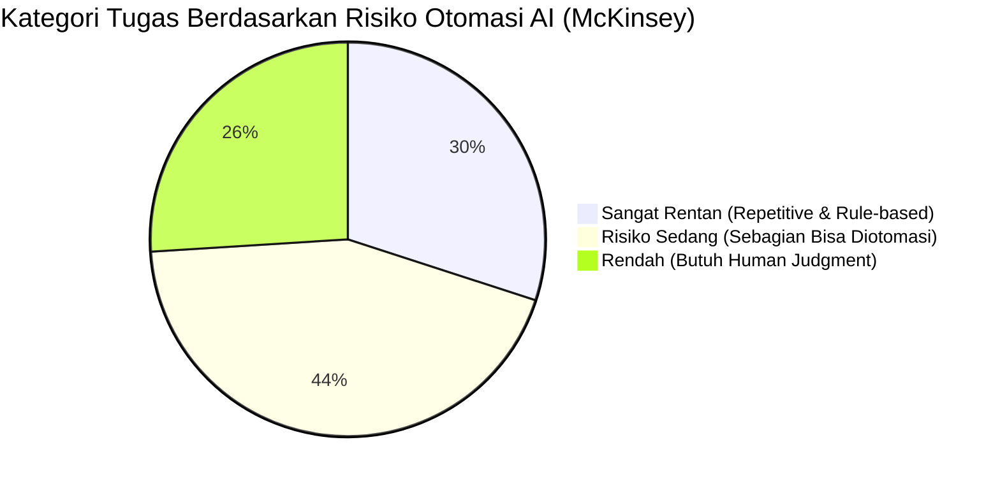
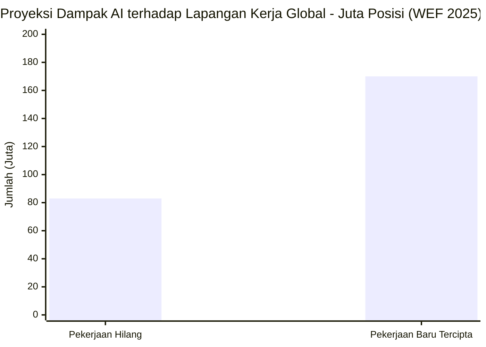

# AI Menggantikan Manusia: Ancaman Nyata atau Alarm Palsu?

McKinsey pernah bikin report yang bilang sekitar **375 juta pekerja** di seluruh dunia berpotensi perlu ganti karir pada 2030 karena otomasi dan AI. WEF dalam Future of Jobs Report 2025 memproyeksikan **83 juta pekerjaan** akan hilang dalam lima tahun ke depan. Angka yang cukup bikin panik. Tapi sebelum lo langsung update LinkedIn dengan "Open to Work" karena takut kena giliran, ada hal yang perlu dipahami lebih dalam. Karena cerita soal AI replacing jobs jauh lebih complicated dari yang keliatan di headline.

---

## Table of Contents

- [Ketakutan yang Masuk Akal](#ketakutan-yang-masuk-akal)
- [Apa yang Sebenarnya Terjadi](#apa-yang-sebenarnya-terjadi)
- [Pekerjaan yang Sudah Berubah](#pekerjaan-yang-sudah-berubah)
- [Yang AI Tidak Bisa Lakukan](#yang-ai-tidak-bisa-lakukan)
- [Sisi Positif yang Jarang Disorot](#sisi-positif-yang-jarang-disorot)
- [Ini Bukan Pertama Kalinya](#ini-bukan-pertama-kalinya)
- [Yang Perlu Lo Lakukan Sekarang](#yang-perlu-lo-lakukan-sekarang)
- [Key Takeaways](#key-takeaways)
- [Sources](#sources)

---

## Ketakutan yang Masuk Akal

Mari jujur dulu. Ketakutan ini bukan lebay, dan bukan sekadar clickbait media.

AI sudah benar-benar menggantikan beberapa pekerjaan. Customer service chatbot sudah mengurangi kebutuhan human agent untuk pertanyaan-pertanyaan yang simple. AI writing tools bikin beberapa klien milih tidak hire penulis untuk konten yang basic. Software akuntansi otomatis mengurangi jam kerja yang dibutuhkan dari seorang bookkeeper.

Menurut Goldman Sachs (2023), sekitar **300 juta full-time jobs** di seluruh dunia berpotensi terotomasi sebagian oleh AI. Bukan hilang total, tapi berubah cukup signifikan sehingga skill yang dibutuhkan ikut bergeser. Dan pergeseran itu tidak menunggu semua orang siap.

Jadi ya, ada yang berubah. Beberapa jenis pekerjaan memang sedang berkurang atau berubah drastis. Kalau pekerjaan lo sifatnya sangat repetitive dan ikutin aturan yang sama terus, ini worth diperhatiin.

Tapi "berubah" dan "hilang total" adalah dua hal yang sangat berbeda.

---

## Apa yang Sebenarnya Terjadi

Narasi "AI akan menggantikan semua pekerjaan" punya satu kelemahan besar: dia memperlakukan pekerjaan sebagai satu unit padat, padahal setiap pekerjaan itu sebenernya kumpulan dari banyak tugas kecil.

AI tidak menggantikan pekerjaan secara keseluruhan. AI menggantikan tugas-tugas tertentu di dalam pekerjaan itu.

Berdasarkan analisis McKinsey, hanya sekitar **30% tugas** dalam pekerjaan yang benar-benar highly automatable saat ini. Sekitar 44% bisa diotomasi sebagian, dan 26% sisanya tetap membutuhkan human judgment yang sulit di-replicate AI.

Contoh nyata: dokter radiologi. AI sudah terbukti bisa mendeteksi beberapa jenis kanker dari hasil scan dengan tingkat akurasi yang mirip dokter spesialis. Apakah dokter radiologi jadi tidak diperlukan lagi? Tidak. Yang terjadi: tugas membaca scan yang berulang-ulang bisa di-assist AI, sementara dokternya fokus ke kasus yang lebih rumit, komunikasi dengan pasien, dan keputusan klinis yang butuh banyak konteks.

Pattern ini sama di hampir semua profesi yang katanya "terancam" AI.

---

## Pekerjaan yang Sudah Berubah

Jujurnya, beberapa jenis pekerjaan sudah terasa perubahannya sekarang, bukan di masa depan:

**Data entry.** Pekerjaan yang intinya cuma "pindahkan informasi dari satu tempat ke tempat lain" sudah sangat bisa diotomasi. Ini bukan prediksi, ini sudah kejadian.

**Konten yang basic.** Menulis deskripsi produk, laporan sederhana dari data yang sudah ada, template artikel: AI bisa handle ini dengan cepat dan murah. Content creator yang tetap dibutuhkan adalah yang punya sudut pandang sendiri, bisa bikin strategi, dan punya suara yang khas.

**Customer support level pertama.** Pertanyaan FAQ, cek status pesanan, troubleshooting yang simpel: chatbot sudah cukup capable untuk ini. Human agent sekarang lebih banyak handle kasus yang butuh empati dan keputusan di luar script.

**Coding yang basic.** Developer yang kerjanya cuma copy dari internet dan sedikit modifikasi memang perlu upgrade skill. Tapi developer yang bisa design sistem, debug masalah yang rumit, dan translate kebutuhan bisnis jadi solusi teknis: demand-nya justru naik.

---

## Yang AI Tidak Bisa Lakukan

Di sinilah perspektif sering terlalu pesimis. Ada hal-hal yang memang susah banget untuk dilakukan AI, setidaknya dalam waktu dekat:

**Ambil keputusan di situasi yang tidak jelas.** AI bagus kalau masalahnya terdefinisi dengan jelas. Tapi kalau situasinya ambigu, ada banyak pihak dengan kepentingan berbeda, dan keputusannya punya sisi etika yang kompleks: manusia masih sangat dibutuhkan. Negosiasi, crisis management, dan leadership dalam kondisi yang tidak pasti adalah contohnya.

**Koneksi yang benar-benar manusiawi.** AI bisa pura-pura empati, tapi tidak bisa benar-benar merasakannya. Dalam pekerjaan yang intinya soal hubungan antar manusia, seperti terapi, mentoring, atau sales yang complex: koneksi manusia ke manusia punya nilai yang berbeda.

**Arah kreatif dan selera.** AI bisa generate ribuan variasi desain atau tulisan. Tapi memutuskan mana yang "pas" untuk sebuah brand, audience, dan momen tertentu masih butuh otak manusia yang punya pemahaman budaya yang dalam.

**Kerja fisik di tempat yang tidak predictable.** Robot bagus di lingkungan yang teratur dan selalu sama. Tapi pekerjaan yang butuh adaptasi fisik di tempat yang berubah-ubah, seperti tukang ledeng di rumah lama yang pipanya berantakan: ini surprisingly susah diotomasi.

---

## Sisi Positif yang Jarang Disorot

Bagian ini paling jarang dapat spotlight, karena "AI creates new jobs" tidak se-dramatis "AI destroys jobs" sebagai headline.

WEF dalam laporan yang sama memproyeksikan bahwa meski **83 juta pekerjaan** akan hilang, akan ada **170 juta pekerjaan baru** yang emerging — net positif sebesar 87 juta posisi secara global.

**AI menciptakan jenis pekerjaan baru yang belum pernah ada.** Prompt engineer, AI trainer, AI ethics officer, AI output checker: lima tahun lalu job title ini tidak ada. Sekarang ada, dan demand-nya terus naik.

**AI bikin expertise lebih mudah diakses semua orang.** Bisnis kecil dulu tidak bisa afford tim marketing yang besar atau lawyer untuk setiap keputusan. AI tools bikin hal-hal itu jadi lebih terjangkau, artinya lebih banyak orang bisa operate di level yang lebih tinggi.

**AI mengangkat batas dari apa yang bisa dicapai manusia.** Seorang peneliti yang dulu butuh berbulan-bulan untuk literature review sekarang bisa selesaikan dalam beberapa hari dengan AI. Developer solo bisa build product yang dulu butuh satu tim. Ini bukan penggantian, ini amplification.

**AI menghilangkan bagian pekerjaan yang paling membosankan.** Banyak pekerjaan punya porsi yang tedious: cleanup data, formatting, cari-cari dokumen, nulis hal-hal yang template banget. Kalau AI yang handle ini, manusia bisa fokus ke bagian yang lebih berarti dan seru.

---

## Ini Bukan Pertama Kalinya

Kalau lo baca sejarah Revolusi Industri di abad ke-18 dan 19, lo akan nemuin kekhawatiran yang persis sama. Para Luddite bukan sekadar orang yang anti-teknologi: mereka adalah pekerja tekstil terampil yang benar-benar kehilangan pekerjaan karena mesin tenun. Kekhawatiran mereka nyata.

Tapi yang terjadi setelah itu? Jumlah total pekerjaan justru naik drastis. Industri baru muncul. Standar hidup meningkat.

Hal yang sama terjadi waktu kalkulator masuk. Waktu ATM muncul, orang prediksi bank teller akan punah. Yang terjadi: jumlah bank teller justru naik, karena ATM bikin buka cabang baru jadi lebih murah, dan teller fokus ke layanan yang lebih bernilai.

Pattern-nya sama terus: teknologi menghilangkan tugas, bukan langsung menghilangkan manusia. Manusia adapt dan cari nilai baru.

Yang bikin AI berbeda dari perubahan sebelumnya adalah kecepatannya. Revolusi industri berlangsung puluhan tahun. AI bergerak dalam hitungan tahun. Itu yang bikin adaptasi jadi lebih challenging, karena waktunya lebih sempit.

---

## Yang Perlu Lo Lakukan Sekarang

Ini bukan soal melawan AI atau menghindarinya. Ini soal positioning diri dengan benar di landscape yang sedang berubah.

**Cari tahu tugas mana dalam pekerjaan lo yang paling mudah diotomasi.** Bukan buat bikin lo paranoid, tapi biar lo punya gambaran: bagian mana yang paling rentan, dan bagian mana yang paling aman?

**Invest di skills yang melengkapi AI, bukan bersaing dengannya.** Berpikir kritis, problem-solving yang kompleks, skill interpersonal, arah kreatif, dan expertise yang dalam di bidang tertentu: ini yang bikin manusia tetap bernilai di dunia yang semakin AI-assisted.

**Pelajari cara kerja dengan AI tools di bidang lo.** Orang yang tahu cara pakai AI secara efektif akan selalu selangkah lebih depan dari yang tidak. Ini sudah terjadi sekarang di banyak bidang.

**Bangun network yang kuat.** Di dunia yang makin banyak diotomasi, trust, hubungan antar manusia, dan judgment dalam keputusan penting jadi makin berharga. Itu sesuatu yang AI tidak bisa replicate.

---

## Key Takeaways

- AI menggantikan tugas, bukan langsung menggantikan pekerjaan. Setiap pekerjaan adalah kumpulan tugas, dan AI hanya capable di sebagian dari tugas-tugas itu.
- Perubahan memang nyata untuk jenis pekerjaan yang sangat repetitive dan ikutin aturan yang sama terus.
- WEF memproyeksikan 83 juta pekerjaan hilang tapi 170 juta pekerjaan baru tercipta — net positif secara global.
- Sejarah menunjukkan bahwa teknologi besar pada akhirnya meningkatkan total pekerjaan, tapi transisinya bisa sulit bagi yang tidak adapt.
- AI bergerak lebih cepat dari perubahan teknologi sebelumnya, jadi adaptasi aktif jadi lebih penting.
- Yang paling aman bukan yang menghindari AI, tapi yang tahu cara kerja sama AI.

---

## Sources

- McKinsey Global Institute, *Jobs Lost, Jobs Gained: Workforce Transitions in a Time of Automation*, 2017
- World Economic Forum, *The Future of Jobs Report 2025*, weforum.org
- Goldman Sachs, *The Potentially Large Effects of Artificial Intelligence on Economic Growth*, 2023
- David Autor, *Work of the Past, Work of the Future*, AEA Papers and Proceedings, 2019
- [MIT Technology Review: The jobs AI will create](https://www.technologyreview.com)

---

*explore / ai-security · Dibuat: 2026-06-02*
